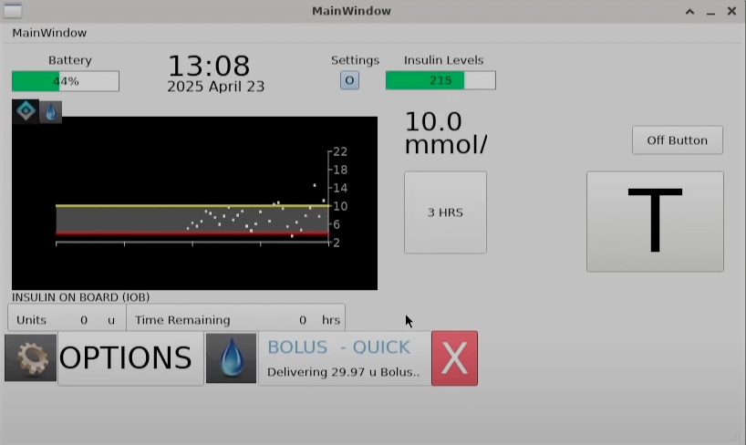
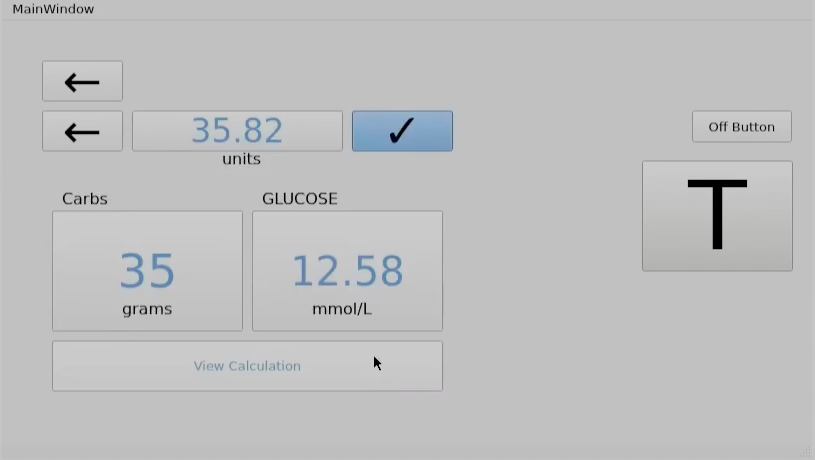
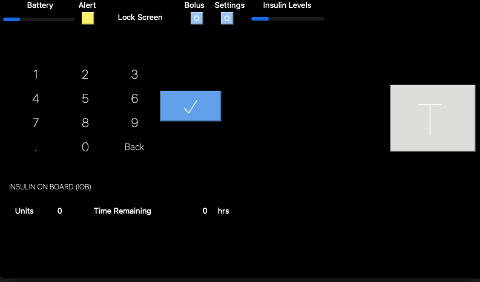

# Tandem t:slim X2 Insulin Pump Simulator

A full-stack simulator of the Tandem t:slim X2 insulin pump, built using C++ and the Qt framework. This project replicates core features of a medical insulin pump including CGM graphing, manual bolus logic, PIN security, and cartridge replacement workflows.

## Features

- Real-time CGM graph with prediction overlays and bolus indicators
- Manual bolus delivery with UI-based dosage input
- Profile management with configurable basal settings
- Secure PIN system with set/change/remove functionality
- Cartridge replacement simulation with timed fill and success screens
- Modular MVC architecture with Qt signals and slots
- JSON-based profile persistence

## Installation

### 1. Install Qt and Qt Creator

Download and install Qt from the official site:  
[https://www.qt.io/download](https://www.qt.io/download)

During installation:
- Select the latest **Qt 6.x version** (e.g., Qt 6.5+)
- Select the **Desktop GCC or MSVC Kit** (depending on your OS)
- Make sure to include the **QtCharts** module when choosing packages

### 2. Clone the Repository

```bash
git clone https://github.com/Raj2b/Tandem-t-slim-X2-Insulin-Pump.git
cd Tandem-t-slim-X2-Insulin-Pump
```
### 3. Open and Run in Qt Creator (Recommended)

1. Launch Qt Creator
2. Open the file: Tandem-t-slim-X2-Insulin-Pump.pro
3. Select a valid Kit (e.g., Desktop Qt 6.5.0 GCC 64bit)
4. Click Build ▶️ and then Run
   - Qt Creator takes care of build tools, compilers, kits, and dependencies for you.
     
### 4. (Optional) Build Manually from Terminal

  - If you have qmake and make installed:
```bash
mkdir build && cd build
qmake ../Tandem-t-slim-X2-Insulin-Pump.pro
make
./Tandem-t-slim-X2-Insulin-Pump
```  
## Usage
   - On startup, the app shows a **lock screen** if a Security PIN is set
   - Use the **homescreen** to monitor real-time CGM values and bolus activity
   - Tap **"Manual Bolus"** to deliver insulin manually via keypad input
   - Access **Profiles** to configure or edit time-based basal settings
   - Use the **"Security PIN"** button to enable, change, or remove PIN protection
   - Open **Device Settings** to simulate cartridge changes or view pump info

## Screenshots

### Homescreen (CGM + Bolus Overview)


### Manual Bolus Entry


### Security PIN Entry


## Architecture

This project follows the **Model-View-Controller (MVC)** pattern:
- **Model**: Person class for real-time CGM values, insulin state
- **View**: Qt UI screens (homescreen, bolus, profiles, etc.)
- **Controller**: Central controller coordinates logic and state

  ## Authors

- **Raj Biswas**  
- **Ryan Mastin**  
- **Steven Wu**
- **Mikhail Pyatakhin**  

## License

This project is currently **not licensed** for reuse.    
Please contact me directly for permission if you wish to use any part of this project.
